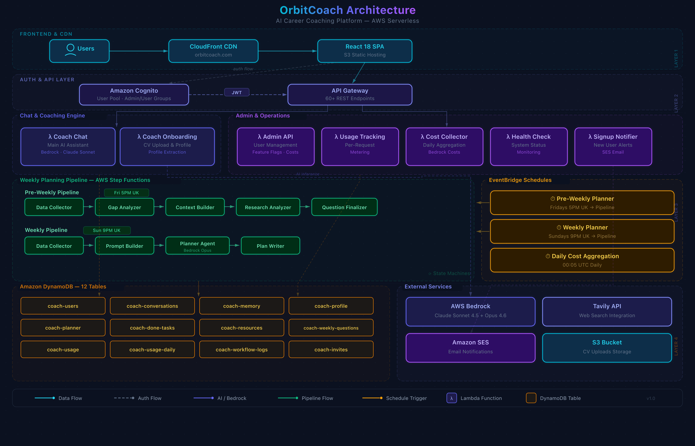

# OrbiitCoach

**AI-powered career coaching platform — not a chatbot, a system that thinks about your career.**

[](https://orbiitcoach.com)
[](https://orbiitcoach.com/architecture)
[](https://aws.amazon.com)
[](https://python.org)
[](https://react.dev)

---

OrbiitCoach is a full-stack AI career coaching platform I designed and built from scratch. It combines multiple Claude models with structured coaching workflows — weekly plans, skill gap analysis, learning resources, and conversational coaching that actually remembers what you told it last week.

**This is not a wrapper around ChatGPT.** It's a purpose-built system with 14 Lambda functions, 3 Claude models (each chosen for specific tasks), 2 Step Function pipelines, and 10 DynamoDB tables — all deployed as Infrastructure as Code via AWS SAM.

## What It Does

| Feature | How it works |
|---------|-------------|
| **AI Career Coaching** | Conversational AI with 13 callable tools (search web, manage tasks, save resources, update profile) |
| **Weekly Plan Generation** | 4-step Step Functions pipeline: collect data → analyse gaps → research market → generate plan |
| **Onboarding** | 6-step flow with CV upload + AI extraction — builds your profile from your resume |
| **Learning Resources** | AI-curated resources matched to your skill gaps, with progress tracking |
| **Persistent Memory** | Facts extracted from every conversation feed back into future coaching |
| **Chrome Extension** | Captures job listings from ATS platforms directly into the coaching system |

<p align="center">
  
  
  
</p>

## Architecture

<p align="center">
  
</p>

The system is built on a serverless event-driven architecture. The core insight is that **different coaching tasks need different AI models**:

- **Claude Haiku 4.5** → Fast operations: fact extraction, classification, structured parsing
- **Claude Sonnet 4.5** → Core coaching: conversation, tool orchestration, resource curation
- **Claude Opus 4.6** → Deep thinking: weekly plan generation, career strategy, gap analysis

Each model is matched to its task based on latency, cost, and reasoning depth. A coaching chat response uses Sonnet (~2s), while a weekly plan generation pipeline uses Opus (~45s) because it needs to synthesise 10+ data sources into a coherent strategy.

→ [**Full Architecture Deep Dive**](https://orbiitcoach.com/architecture)

### Infrastructure at a Glance

| Layer | Components |
|-------|-----------|
| **Frontend** | React 18 SPA, Tailwind CSS, Framer Motion → CloudFront + S3 |
| **Auth** | AWS Cognito with JWT authorizer on API Gateway |
| **API** | API Gateway (REST) → 14 Lambda functions (Python 3.11) |
| **AI** | AWS Bedrock — 3 Claude models with native function calling |
| **Data** | 10 DynamoDB tables with GSIs for access patterns |
| **Orchestration** | 2 Step Functions state machines + EventBridge scheduling |
| **IaC** | AWS SAM (CloudFormation) — entire stack defined in `template.yaml` |

## Key Technical Highlights

### Multi-Model Orchestration
The system doesn't just call an LLM — it orchestrates a pipeline. Weekly plan generation, for example, runs a 4-step Step Functions workflow:

```
Collect User Data → Analyse Skill Gaps → Research Market → Generate Plan
    (DynamoDB)        (Claude Haiku)       (Claude Sonnet)    (Claude Opus)
```

Each step's output feeds the next. The plan generator receives a structured brief assembled from profile data, previous week performance, learning progress, market research, and long-term memory.

### Structured LLM Interactions
All LLM calls use Claude's native function calling (Converse API) with JSON schema enforcement — no regex parsing of free-form text. See [`samples/bedrock_client.py`](samples/bedrock_client.py) for the implementation.

### Prompt Engineering as Architecture
Prompts are versioned, templated, and testable. Each prompt extends a base class with defined contracts for system prompt, user prompt, tool schema, and validation. See [`samples/template_engine.py`](samples/template_engine.py) for the pattern.

### Feedback Loops
The system learns from every interaction:
- **Memory extraction**: Facts from conversations are extracted and stored for future context
- **Performance tracking**: Task completion rates from previous weeks inform next week's plan difficulty
- **Resource progress**: Learning resource completion feeds back into skill gap analysis

### Data Assembly Pattern
The weekly plan generation assembles 10+ data sources into a single prompt — profile, time budget, previous performance, learning resources, skill gaps, market research, and long-term memory. This is separated from the LLM call itself, making it testable and maintainable. See [`samples/prompt_builder.py`](samples/prompt_builder.py).

## Code Samples

This repo includes sanitised code samples demonstrating the architectural patterns:

| File | What it shows |
|------|--------------|
| [`samples/bedrock_client.py`](samples/bedrock_client.py) | AWS Bedrock Converse API wrapper with native function calling + retry with self-correction |
| [`samples/template_engine.py`](samples/template_engine.py) | Abstract base class for versioned, testable prompt templates |
| [`samples/prompt_builder.py`](samples/prompt_builder.py) | Multi-source data assembly for LLM context (no LLM call — pure data orchestration) |

These are extracted from the production codebase to illustrate design decisions. The full application runs in a private monorepo.

## Design Decisions

| Decision | Choice | Why |
|----------|--------|-----|
| Serverless over containers | AWS Lambda | Per-request billing, zero idle cost, no ops overhead for a solo builder |
| Multi-model over single model | 3 Claude models | Match model capability to task complexity — don't pay Opus prices for classification |
| Function calling over text parsing | Converse API | Schema-enforced structured output eliminates brittle regex parsing |
| Step Functions over in-Lambda orchestration | State machines | Visual debugging, built-in retry, timeout handling, step-level monitoring |
| DynamoDB over RDS | NoSQL | Serverless-native, pay-per-request, no connection pooling headaches in Lambda |
| Prompt templates over ad-hoc strings | Base class pattern | Versioning, testing, consistency across 6+ prompt types |

→ [**Full Design Decisions Document**](docs/design-decisions.md)

## Tech Stack

**Backend:** Python 3.11 · AWS Lambda · API Gateway · DynamoDB · Step Functions · EventBridge · Cognito · S3 · CloudFront · AWS Bedrock (Claude Sonnet 4.5, Haiku 4.5, Opus 4.6) · Tavily API

**Frontend:** React 18 · TypeScript · Tailwind CSS · Framer Motion · React Query

**Infrastructure:** AWS SAM · CloudFormation · GitHub Actions

## Links

- 🌐 **Live product:** [orbiitcoach.com](https://orbiitcoach.com)
- 📐 **Architecture review:** [orbiitcoach.com/architecture](https://orbiitcoach.com/architecture)
- 👤 **Portfolio:** [adriengourier.com](https://adriengourier.com)
- 💼 **LinkedIn:** [linkedin.com/in/adriengourier](https://linkedin.com/in/adriengourier)

---

*Built by [Adrien Gourier](https://adriengourier.com)*
